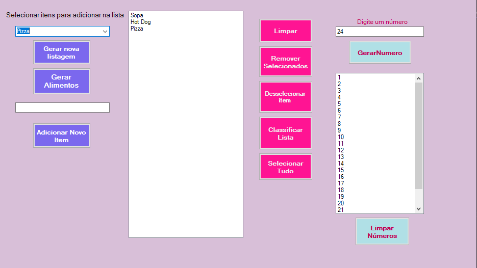

<h1 align="center"> ListBox C#</h1>

Projeto iniciante com C#  

  <a href="#-tecnologias">Tecnologias</a>&nbsp;&nbsp;&nbsp;|&nbsp;&nbsp;&nbsp;
  <a href="#-projeto">Projeto</a>&nbsp;&nbsp;&nbsp;
  

 

  

## 🚀 Tecnologias

Esse projeto foi desenvolvido com as seguintes tecnologias:

- C#

## 💻 Projeto

Projeto iniciante para aprender e colocar em pratica algumas funcionalidades da linguagem de programação C#
